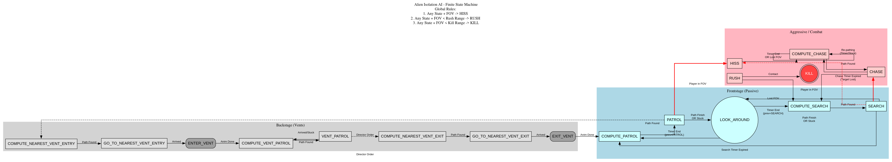

#  Alien : Isolation 2D (Fangame)

A 2D top-down stealth and survival game inspired by *Alien: Isolation*, focused on creating a challenging and robust enemy A.I. using custom pathfinding and physics interaction.

---


## Enemy AI Architecture (Finite State Machine)

The Alien's behavior is driven by a complex Finite State Machine (FSM) that dictates its movement, aggression, and tactical decision-making.



---

### Prerequisites

To run this project, you need **Python 3.x** and the **Pygame** library.

```bash
# Install Pygame
pip install pygame

# Run game
python main.py
